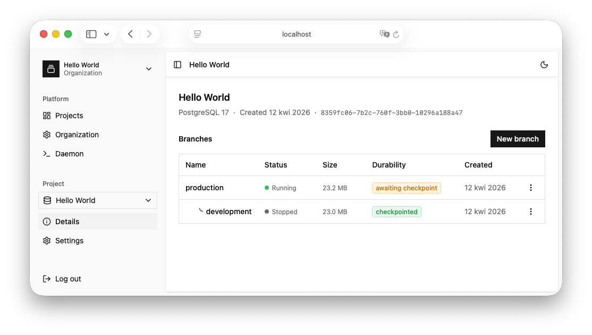

<div align="center">
  

<h3>DX-focused control plane for PostgreSQL</h3>
  <p>NeonD is an open-source Neon-based control plane daemon for PostgreSQL. It offers S3-based layer durability, instant branching, precise Point-in-time recovery in seconds. Runs as a single Docker container, handles multi-tenant PostgreSQL instances seamlessly.</p>

[](https://www.postgresql.org/)
[](LICENSE)
[](https://github.com/matisiekpl/neond)
[](https://github.com/matisiekpl/neond)

  <p>
    <a href="#-features">Features</a> •
    <a href="#-installation">Installation</a> •
    <a href="#-usage">Usage</a> •
    <a href="#-motivation">Motivation</a> •
    <a href="#-license">License</a>
  </p>



</div>

## ✨ Features

- **Launch PostgreSQL instances** - versions v14, v15, v16, v17 supported
- **Branching** - branch your **production** timeline to multiple **development** or **preview** branches
- **S3 Checkpoints** - your data are durably stored on Amazon S3 - checkpoint interval fully configurable
- **Easy migration** - moving NeonD between servers is super easy. Shutdown the server and copy a single directory.
- **TLS SNI Routing** - NeonD generates `{instance-slug}.your-company.com` endpoints. Multiple Postgres instances a
  under single domain.
- **Full Security** - control plane takes care about SSL certificates and keys to enable secure connection
- **Multi-Tenancy** - create multiple users and share compute to other developers with configured roles

> NeonD is not designed to be deployed in critical application environments. Its purpose is to
> provide a DX-oriented PostgreSQL platform for early-stage startup projects, where innovation and velocity are more
> important than reliability. The recommended deployment environment is bare metal VPS Server.

---

## 📦 Installation

The easiest way of deployment is to spin-up NeonD using Docker Compose.

```yaml
services:
  neond:
    image: neond/neond:latest
    environment:
      PORT: 3000
      SERVER_SECRET: "SuperSecret" # you should change this
      PORT_RANGE: 50000-50010
    ports:
      - "3000:3000"
      - "50000-50010:50000-50010"
    restart: unless-stopped
    volumes:
      - ./neond_data:/neond
```

Or, if you want to use TLS SNI Router with custom domain:

```yaml
services:
  neond:
    image: neond/neond:latest
    environment:
      PORT: 3000
      SERVER_SECRET: "SuperSecret" # you should change this
      PG_PROXY_PORT: "5432"
      PG_HOSTNAME: company.com # would generate {instance-slug}.company.com endpoints
    ports:
      - "3000:3000"
      - "5432:5432"
    restart: unless-stopped
    volumes:
      - ./neond_data:/neond
```

If you want to switch to S3 durable storage, pass following environment variables:

```yaml
services:
  neond:
    ...
    environment:
      ...
      AWS_ACCESS_KEY_ID:
      AWS_SECRET_ACCESS_KEY:
      AWS_S3_BUCKET:
      AWS_REGION:
    ...
```

---

## 🚀 Usage

1. After launch, navigate to `http://localhost:3000`
2. Sign up and name a new organization
3. Create new project and go to it.
4. Click on options of default `production` branch and click "Start endpoint".
5. Click on options of branch and "Copy Connection String".
6. Connect to database - for example `psql '<connection_string>'`

## ⚠️ Caveats

- `SERVER_SECRET` can't be changed after initial launch!
- Architecture is intentionally tightly-coupled to provide ease of use.
- It is recommended to launch only one instance of NeonD per server.

## 🚀 Motivation

This project has been founded by [Mateusz Woźniak](http://github.com/matisiekpl/), because he found particurly hard to
quickly spinup PostgreSQL instances on small VPS Servers. Project heavily depends
on [neondatabase/neon](https://github.com/neondatabase/neon) project - neond is the control plane layer for it. Big
kudos for entire Neon team!

## 📝 License

This project is licensed under the Apache 2.0 License - see the [LICENSE](LICENSE) file for details